# Automated Screenshots of included Presets

## 3024

## 3024.light

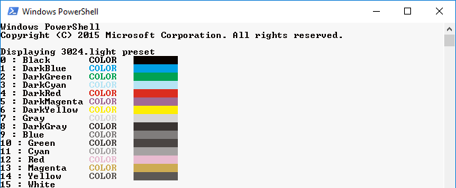

## atelierdune

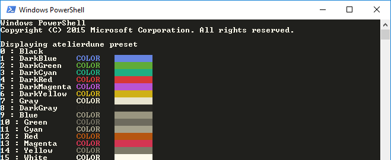

## atelierdune.light

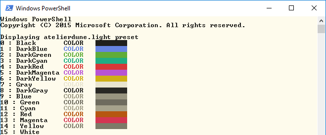

## atelierforest

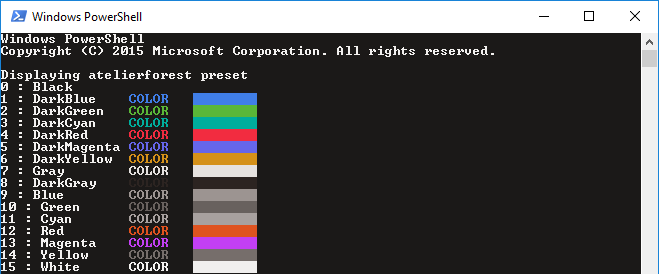

## atelierforest.light

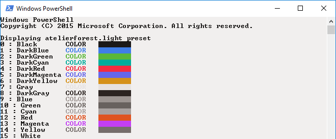

## atelierheath

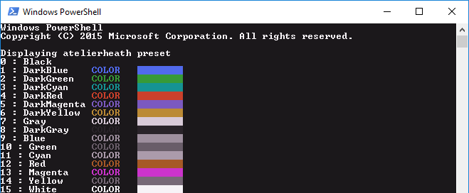

## atelierheath.light

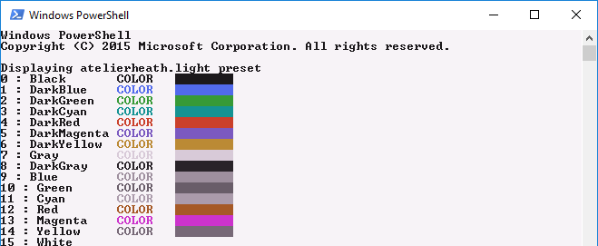

## atelierlakeside

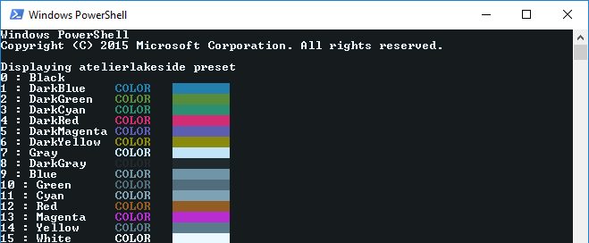

## atelierlikeside.light

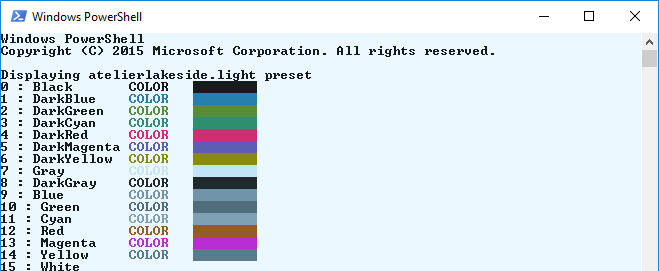

## atelierseaside

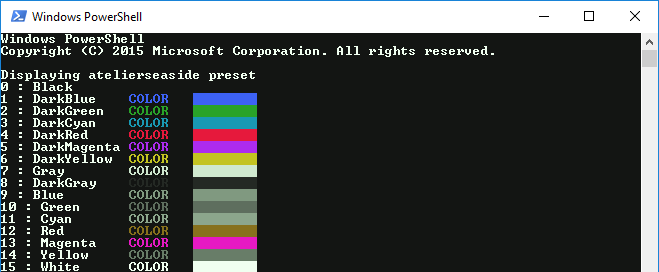

## atelierseaside.light

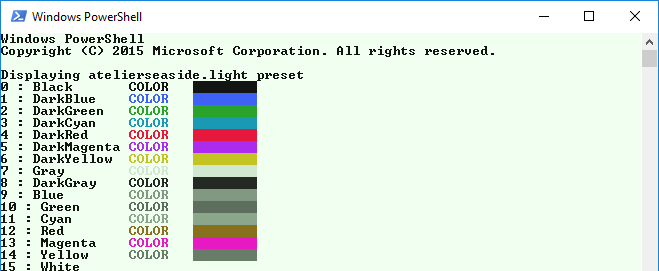

## bespin

## bespin.light

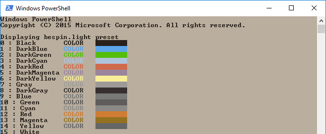

## big

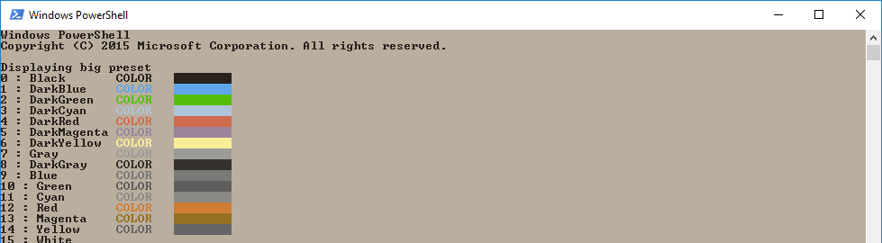

## chalk

## chalk.light

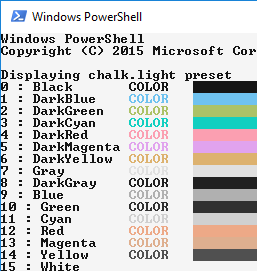

## defaults

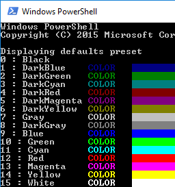

## eighties

## eighties.light

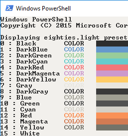

## flat

## grayscale

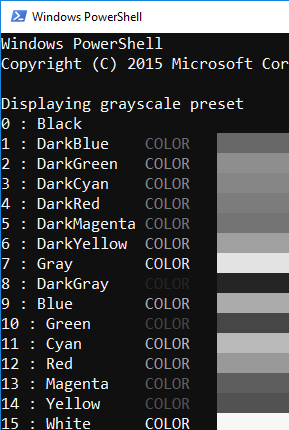

## grayscale.light

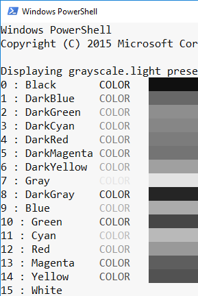

## greenscreen

## greenscreen.light

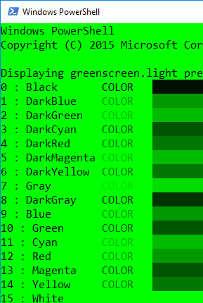

## isotope

## isotope.light

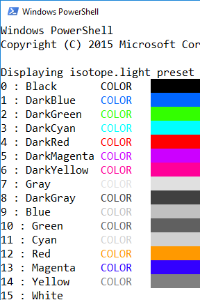

## londontube

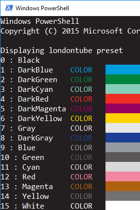

## londontube.light

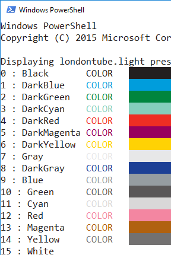

## marrakesh

## marrakesh.light

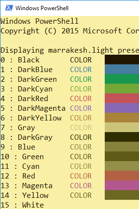

## medium

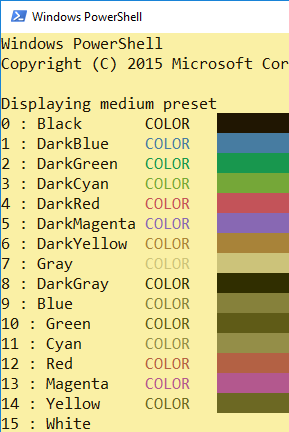

## mocha

## mocha.light

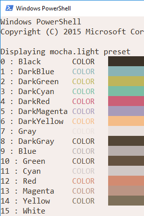

## monokai

## monokai.light

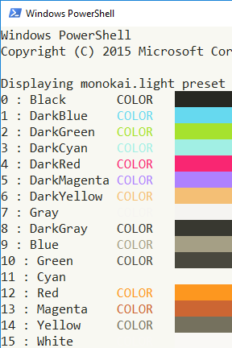

## mountain

## ocean

## ocean.light

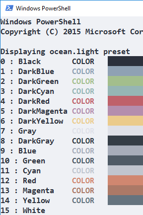

## oceanicnext

## paraiso

## paraiso.light

## powershell-defaults

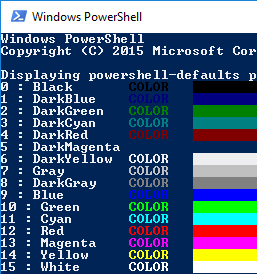

## railscasts

## railscasts.light

## shapshifter

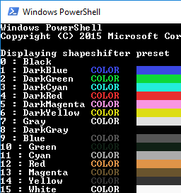

## shapshifter.light

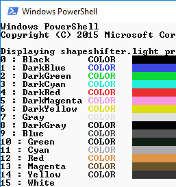

## small

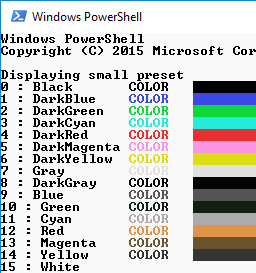

## solarized

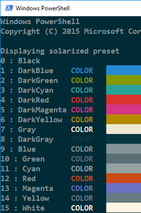

## solarized-light

## tomorrow

## tomorrow.light

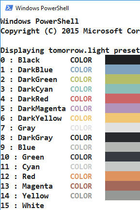

## twilight

## twilight.light

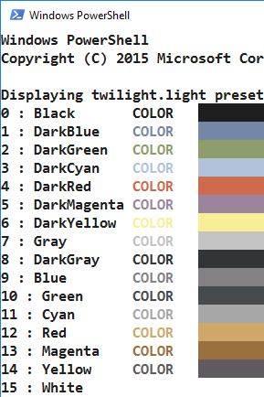

# Generate Windows to perform Screenshots

1. Open powershell and navigate to the directory that contains `outcolors.ps1` and `theme-output-comparison.ps1`.
2. execute `theme-output-comparison.ps1` 
3. Wait for all presets to finish.
4. Take screenshots of each screen cropping out prompt.

# Generating README

## requirements

1. python 3.5
2. jinja2

## generation

1. open terminal to folder containing all images.
2. run `python gen_readme.py`